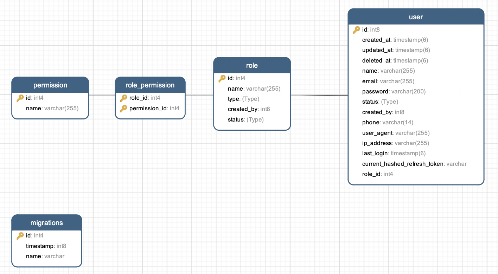

# Nestjs Boilerplate - SASS (Software as a service) with Postgres SQL

## Description

[Nest](https://github.com/nestjs/nest) framework TypeScript starter repository.



## Requirements

- [Docker >= 26](https://docs.docker.com/install)
- [Node >= 20.16](https://nodejs.org/en/download/)
- [Postgres SQL](https://www.postgresql.org/)

## Installation

```bash
npm install
```

## Setup develop environment and start app

```bash
docker compose -f docker-compose-dev.yml up --build
```

## Setup only database then start in the local

```bash
docker compose -f docker-compose-db.yml up --build
```

## Running the app

```bash
cp .env.example .env

# Run migration database
npm run typeorm:run-migrations

# development
npm run start

# watch mode
npm run start:dev

# production mode
npm run start:prod
```

## API documentation

http://localhost:8000/api

## Test

```bash
# unit tests
npm run test

# e2e tests
npm run test:e2e

# test coverage
npm run test:cov
```

Config [Unit Test Report](https://stackoverflow.com/questions/24825860/how-to-get-the-code-coverage-report-using-jest) to HTML in package.json

```bash
"jest": {
    "collectCoverage": true,
    "coverageReporters": ["json", "html"],
}
```

## Stay in touch

- Author - [Richard Do](https://github.com/ptit9x)

## License

Nest is [MIT licensed](LICENSE).
